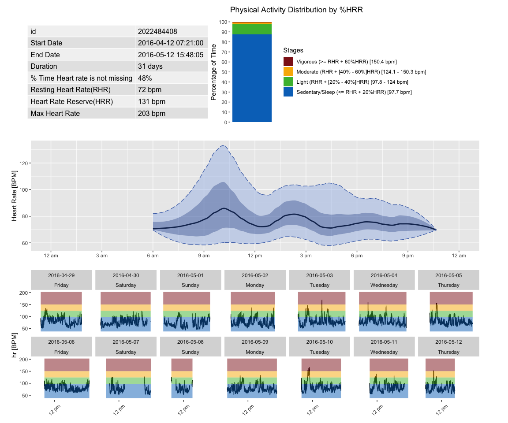

<!-- README.md is generated from README.Rmd. Please edit that file -->

# ihr: Interpreting heart rate data from wearable devices

The R package ‘ihr’ is designed to provide functions for outputting
metrics for heart rate data collected from wearable devices (i.e. Apple
watches, Fitbits, etc.). ihr supports data that tracks heart rate
(measured in BPM) over time.

ihr comes with two example datasets, [publicly provided via
Kaggle](https://www.kaggle.com/datasets/arashnic/fitbit/versions/1).
These data were collected from Fitbit devices. Please refer to the
examples below for loading and using the data.

## Installation

``` r
# install.packages("devtools")

# Plain installation
devtools::install_github("IrinaStatsLab/ihr") # ihr package

# For installation with vignette
devtools::install_github("IrinaStatsLab/ihr", build_vignettes = TRUE)
```

## Example

A simple example of an analysis of heart rate data using ihr are shown
below. The first plot provides Ambulatory Heart Rate (AHR) profile that
includes summary statistics and visualizations. The other functions
provide additional metrics and summaries of the heart rate data.

``` r
library(ihr)
data("example_heart_1") # Load single subject data
# Plot high level overview of a subject's heart rate data
ahp(example_heart_1)
#> Warning in plot_ahp(data, inter_gap = inter_gap, tz = tz): 439 observations are
#> missing for plot_ahp. Times with missing values will be empty in the plot.
```



``` r
# Summary statistics and other metrics
summary_hr(example_heart_1)
#> # A tibble: 1 × 8
#>           id mean_hr median_hr min_hr q1_hr q3_hr max_hr sd_hr
#>        <dbl>   <dbl>     <dbl>  <dbl> <dbl> <dbl>  <dbl> <dbl>
#> 1 2022484408    80.2        76     38    68    89    203  17.6
mahe(example_heart_1)
#> Gap found in data for subject id: 2022484408, that exceeds 12 hours.
#> # A tibble: 1 × 2
#> # Rowwise: 
#>           id  MAHE
#>        <dbl> <dbl>
#> 1 2022484408  49.4
episode_calculation(example_heart_1)
#> # A tibble: 3 × 6
#>           id level     avg_ep_per_day avg_ep_duration avg_ep_hr total_episodes
#>        <dbl> <chr>              <dbl>           <dbl>     <dbl>          <dbl>
#> 1 2022484408 Sedentary         5.11             258.       75.8             76
#> 2 2022484408 Moderate          0.605             33.8     144.               9
#> 3 2022484408 Vigorous          0.0672            17       155.               1
sd_roc(example_heart_1)
#> # A tibble: 1 × 2
#>           id sd_roc
#>        <dbl>  <dbl>
#> 1 2022484408   5.46
```

## Acknowledgements

This package, ihr, incorporates and adapts functionality originally
developed in the [iglu R package](https://github.com/irinagain/iglu) in
the following components:

- Interpolation and grid alignment logic in `HR2DayByDay()` was inspired
  by `CGMS2DayByDay()` in iglu, with modifications to support heart rate
  data rather than glucose values.

- Summary episode metrics such as episode count, duration, and average
  values were conceptually adapted from similar calculations in iglu’s
  time-in-range and excursion detection functions, refactored to reflect
  heart rate reserve (HRR) thresholds and levels (Sedentary, Moderate,
  Vigorous).

- Plotting infrastructure and the overall structure of subject-level
  summaries were influenced by iglu, with extensions specific to heart
  rate interpretation and visualizations such as plot_ahp().
